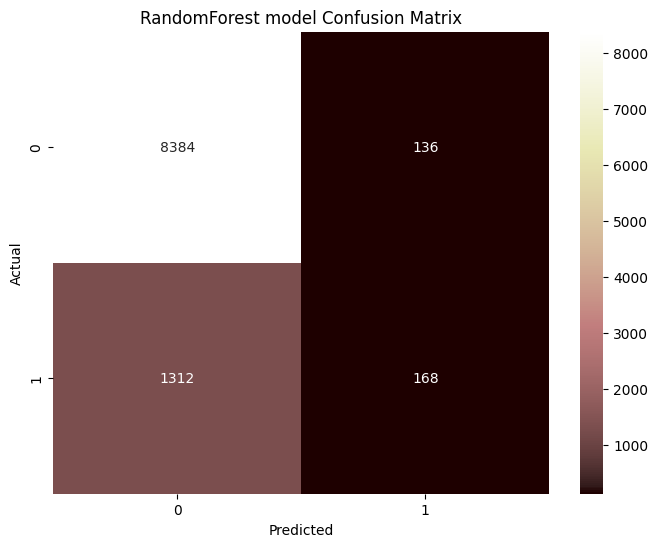
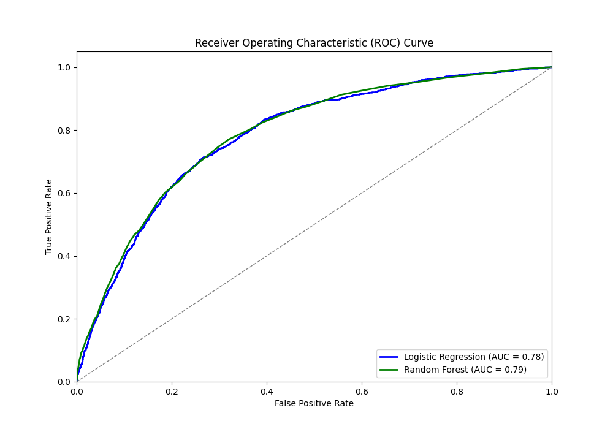
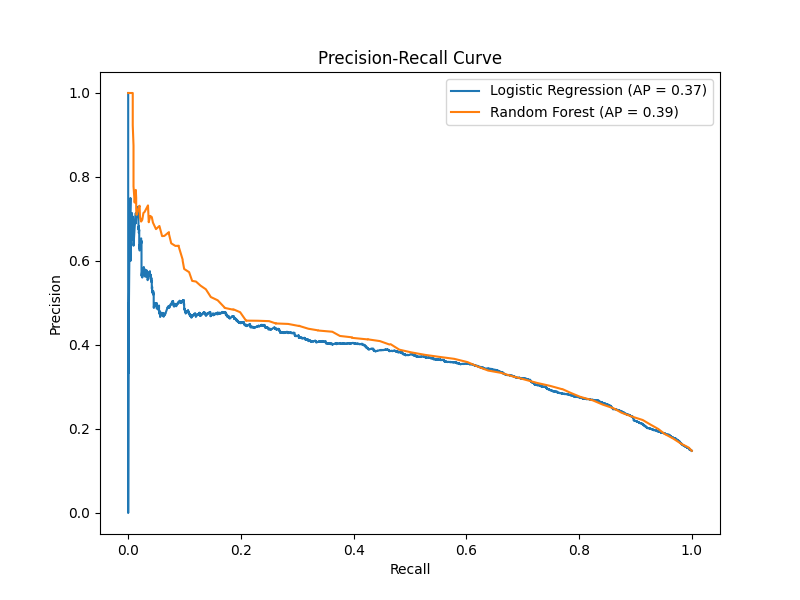

# Predictive Modeling of Customer Bookings

This repository contains the code and results for a predictive model developed to forecast customer bookings. The project aims to utilize machine learning techniques to predict whether a customer will book a holiday based on various features in the provided dataset.

## Project Overview

The objective of this project is to build and evaluate predictive models to determine the likelihood of customers booking holidays. The analysis includes data preprocessing, model training, evaluation, and interpretation of feature importance.

## Repository Structure

- **NewAnalysis.ipynb**: Jupyter notebook containing the entire analysis and model development process.
- **README.md**: This file, providing an overview and instructions for the project.
- **customer_booking.csv**: Dataset used for training and evaluating the models.
- **feature importance.png**: Visual representation of feature importance from the RandomForest model.
- **histogram_selected_feature.png**: Histogram of a selected feature from the dataset.
- **logistic regression confusion matrix.png**: Confusion matrix for the Logistic Regression model.
- **precision_recall_comparison.png**: Precision-recall comparison between RandomForest and Logistic Regression models.
- **randomForestConfusionmatrix.png**: Confusion matrix for the RandomForest model.
- **rf_feature_importance.png**: Detailed feature importance from the RandomForest model.
- **roc_curve_comparison.png**: ROC curve comparison between RandomForest and Logistic Regression models.
- **scatter_plot_flight_duration.png**: Scatter plot of flight duration vs. target variable.
- **scatter_plot_length_of_stay.png**: Scatter plot of length of stay vs. target variable.
- **scatter_plot_purchase_lead.png**: Scatter plot of purchase lead time vs. target variable.

## Data Preprocessing

The dataset underwent several preprocessing steps:
- Handling missing values
- Encoding categorical variables
- Normalizing numerical features
- Splitting the data into training and testing sets

## Model Training

Two machine learning algorithms were used for this project:
1. RandomForest
2. Logistic Regression

The models were trained and their performance was evaluated using confusion matrices, ROC curves, and precision-recall analysis.

## Model Evaluation

### Confusion Matrices
- **RandomForest**: 
- **Logistic Regression**: 

### ROC Curves
- 

### Precision-Recall Comparison
- 

## Feature Importance

The RandomForest model provides insights into which features are most important for predicting customer bookings.

- 

## Results Interpretation

The analysis demonstrated that the RandomForest model performed better in predicting customer bookings. The feature importance analysis revealed that variables such as flight duration, length of stay, and purchase lead time significantly contribute to the model's predictive power.

## Conclusion

This project successfully developed and evaluated a predictive model for customer bookings. Future work could involve exploring other machine learning algorithms, tuning hyperparameters, and incorporating additional features for improved performance.

## How to Use

1. Clone the repository:
   ```sh
   git clone https://github.com/Varshamishra56/ML_model.git
2. Navigate to the project directory:
   ```sh
   cd customer_booking_British_Airways_MLmode
3. Open the Jupyter notebook to explore the analysis:
   ```sh
   jupyter notebook NewAnalysis.ipynb

```sh
   You can copy this code into your `README.md` file in your GitHub repository. Adjust the repository link if necessary.

## If you find this project useful or interesting, please consider starring ⭐ the repository to show your support!💕
